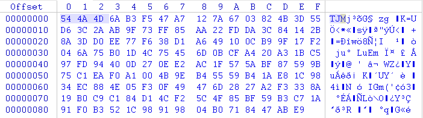

放置江湖
===========================


000
---------------------------
这篇是之前《放置江湖》的续集。在上一篇中我成功的获得了游戏中的一些原始数据，根据这些数据我对我的人物的职业规划有了初步的设想。然而当我正准备在江湖中大展手脚闯荡出一番天地的时候，悲剧发生了。游戏需要用元宝才能解锁11关以后的关卡。虽然每日签到奖励每周会送一些元宝，但是需要签到三周才能积攒足够的元宝解锁11-20关。之后的关卡则需要更长时间。一开始我本着游戏公司也是需要赚钱的，我是免费玩家我忍了的想法。大不了先闭门练功，出关后再横扫江湖。谁知第二天发现连闭关练功也不让了，需要打通12关才能继续。也就是说免费玩家在接下去的两周时间里什么事情也做不了了。我玩游戏这么年没见过这样对待免费玩家的，真是士可忍孰不可忍！

也许有很多方法可以暴力破解这个限制。但是因为我玩游戏的手机没有root，root需要双清手机我可舍不得。直接改游戏安装包也可以，但是估计存档要没，也舍不得。想想还有什么办法？

001
---------------------------
用我的笔记本作为热点，抓个包看看。客户端和服务器之间的通信大概是这样的。xxxxxx是马赛克。

```
GET /api/v5/get_time HTTP/1.1
Accept-Encoding: identity
device: {"dev_name":"gemini","dev_model":"MI 5","dev_systemName":"android 24","dev_systemVersion":"7.0","dev_idfv":"xxxxxxxxxxxxxxxxxxxxxxxxxxxxxxxx","dev_net":"WIFI","app_name":"放置江湖","app_version":"1.0.8","app_build":"android-17","app_channel":"taptap"}
hotver: 1788
nouce: axQgOZ
sig: 9cbc46f576f88737075c2f7e3bfafdfc
time: 0.0001
userid: xxxxxx
uuid: xxxxxxxxxxxxxxxxxxxxxxxxxxxxxxxx
ver: 1.0.8
User-Agent: Dalvik/2.1.0 (Linux; U; Android 7.0; MI 5 MIUI/V8.2.1.0.NAACNEB)
Host: fzjh.android.helloyanming.com
Connection: Keep-Alive

HTTP/1.1 200 OK
Server: nginx/1.4.4
Date: Tue, 14 Mar 2017 07:16:28 GMT
Content-Type: application/json;charset=utf-8
Content-Length: 286
Connection: keep-alive
X-Powered-By: PHP/5.5.7

544a4d6ab3f547a7127a6703824b3d55d63c2aab9f73ff85aa22fdda3c84142b8a3dd0ee77f638d1a649100cb99f17f2046a75b01d4c75456d0bcfa420a31bc597fd94400d270ee2ac1f575abf87599b75c1eaf0a1004b9eb45559b41ae81c9834ec884e05f30f49476d2827a2f3338a19b0c9c184d14cf25c4f85bf59b3c71a91f0b3521c98919804b0718447abe9
```

我么可以看到服务器返回的数据是16进制字符串。解开看看。



前三个字符是"TJM"。大家还记得在上一篇里面的lua文件的前六个字节是ABCTJM。显然这段数据也是加密的并且加密方法非常类似。其实细心的我早就发现了，在拿key的那个函数JM::gdk()有两个分支。一个分支是判断加密数据的前6个字节是不是"ABCTJM"。另一个分支判断的是前3个字节是不是"TJM"。

```asm
00457a58 <JM::gdk(unsigned char*, unsigned int, unsigned char*, unsigned int*)>:
  457a58:	b5f0      	push	{r4, r5, r6, r7, lr}
  457a5a:	4d2f      	ldr	r5, [pc, #188]	; (457b18 <JM::gdk(unsigned char*, unsigned int, unsigned char*, unsigned int*)+0xc0>)
  457a5c:	1c14      	adds	r4, r2, #0
  457a5e:	447d      	add	r5, pc
  457a60:	682d      	ldr	r5, [r5, #0]
  457a62:	b093      	sub	sp, #76	; 0x4c
  457a64:	1e01      	subs	r1, r0, #0
  457a66:	682a      	ldr	r2, [r5, #0]
  457a68:	9211      	str	r2, [sp, #68]	; 0x44
  457a6a:	d04c      	beq.n	457b06 <JM::gdk(unsigned char*, unsigned int, unsigned char*, unsigned int*)+0xae>
  457a6c:	780a      	ldrb	r2, [r1, #0]
  457a6e:	2a41      	cmp	r2, #65	; 0x41
  457a70:	d126      	bne.n	457ac0 <JM::gdk(unsigned char*, unsigned int, unsigned char*, unsigned int*)+0x68>
  457a72:	784a      	ldrb	r2, [r1, #1]
  457a74:	2000      	movs	r0, #0
  457a76:	2a42      	cmp	r2, #66	; 0x42
  457a78:	d145      	bne.n	457b06 <JM::gdk(unsigned char*, unsigned int, unsigned char*, unsigned int*)+0xae>
  457a7a:	788a      	ldrb	r2, [r1, #2]
  457a7c:	2a43      	cmp	r2, #67	; 0x43
  457a7e:	d142      	bne.n	457b06 <JM::gdk(unsigned char*, unsigned int, unsigned char*, unsigned int*)+0xae>
  457a80:	78ca      	ldrb	r2, [r1, #3]
  457a82:	2a54      	cmp	r2, #84	; 0x54
  457a84:	d13f      	bne.n	457b06 <JM::gdk(unsigned char*, unsigned int, unsigned char*, unsigned int*)+0xae>
  457a86:	790a      	ldrb	r2, [r1, #4]
  457a88:	2a4a      	cmp	r2, #74	; 0x4a
  457a8a:	d13c      	bne.n	457b06 <JM::gdk(unsigned char*, unsigned int, unsigned char*, unsigned int*)+0xae>
  457a8c:	794a      	ldrb	r2, [r1, #5]
  457a8e:	2a4d      	cmp	r2, #77	; 0x4d
  457a90:	d139      	bne.n	457b06 <JM::gdk(unsigned char*, unsigned int, unsigned char*, unsigned int*)+0xae>
  457a92:	2001      	movs	r0, #1
  457a94:	2c00      	cmp	r4, #0
  457a96:	d036      	beq.n	457b06 <JM::gdk(unsigned char*, unsigned int, unsigned char*, unsigned int*)+0xae>
  457a98:	2206      	movs	r2, #6
  457a9a:	4e20      	ldr	r6, [pc, #128]	; (457b1c <JM::gdk(unsigned char*, unsigned int, unsigned char*, unsigned int*)+0xc4>)
  457a9c:	af01      	add	r7, sp, #4
  457a9e:	601a      	str	r2, [r3, #0]
  457aa0:	447e      	add	r6, pc
  457aa2:	1c31      	adds	r1, r6, #0
  457aa4:	2240      	movs	r2, #64	; 0x40
  457aa6:	1c38      	adds	r0, r7, #0
  457aa8:	f2b2 f89c 	bl	709be4 <cocos2d::TextureAtlas::increaseTotalQuadsWith(int)+0x110>
  457aac:	1c31      	adds	r1, r6, #0
  457aae:	1c20      	adds	r0, r4, #0
  457ab0:	3140      	adds	r1, #64	; 0x40
  457ab2:	2240      	movs	r2, #64	; 0x40
  457ab4:	f2b2 f896 	bl	709be4 <cocos2d::TextureAtlas::increaseTotalQuadsWith(int)+0x110>
  457ab8:	1c20      	adds	r0, r4, #0
  457aba:	1c39      	adds	r1, r7, #0
  457abc:	3040      	adds	r0, #64	; 0x40
  457abe:	e01e      	b.n	457afe <JM::gdk(unsigned char*, unsigned int, unsigned char*, unsigned int*)+0xa6>
  457ac0:	2000      	movs	r0, #0
  457ac2:	2a54      	cmp	r2, #84	; 0x54
  457ac4:	d11f      	bne.n	457b06 <JM::gdk(unsigned char*, unsigned int, unsigned char*, unsigned int*)+0xae>
  457ac6:	784a      	ldrb	r2, [r1, #1]
  457ac8:	2a4a      	cmp	r2, #74	; 0x4a
  457aca:	d11c      	bne.n	457b06 <JM::gdk(unsigned char*, unsigned int, unsigned char*, unsigned int*)+0xae>
  457acc:	788a      	ldrb	r2, [r1, #2]
  457ace:	2a4d      	cmp	r2, #77	; 0x4d
  457ad0:	d119      	bne.n	457b06 <JM::gdk(unsigned char*, unsigned int, unsigned char*, unsigned int*)+0xae>
  457ad2:	2001      	movs	r0, #1
  457ad4:	2c00      	cmp	r4, #0
  457ad6:	d016      	beq.n	457b06 <JM::gdk(unsigned char*, unsigned int, unsigned char*, unsigned int*)+0xae>
  457ad8:	2203      	movs	r2, #3
  457ada:	4f11      	ldr	r7, [pc, #68]	; (457b20 <JM::gdk(unsigned char*, unsigned int, unsigned char*, unsigned int*)+0xc8>)
  457adc:	ae01      	add	r6, sp, #4
  457ade:	601a      	str	r2, [r3, #0]
  457ae0:	447f      	add	r7, pc
  457ae2:	1c39      	adds	r1, r7, #0
  457ae4:	2240      	movs	r2, #64	; 0x40
  457ae6:	1c30      	adds	r0, r6, #0
  457ae8:	f2b2 f87c 	bl	709be4 <cocos2d::TextureAtlas::increaseTotalQuadsWith(int)+0x110>
  457aec:	1c39      	adds	r1, r7, #0
  457aee:	1c20      	adds	r0, r4, #0
  457af0:	3140      	adds	r1, #64	; 0x40
  457af2:	2240      	movs	r2, #64	; 0x40
  457af4:	f2b2 f876 	bl	709be4 <cocos2d::TextureAtlas::increaseTotalQuadsWith(int)+0x110>
  457af8:	1c20      	adds	r0, r4, #0
  457afa:	1c31      	adds	r1, r6, #0
  457afc:	3040      	adds	r0, #64	; 0x40
  457afe:	2240      	movs	r2, #64	; 0x40
  457b00:	f2b2 f870 	bl	709be4 <cocos2d::TextureAtlas::increaseTotalQuadsWith(int)+0x110>
  457b04:	2001      	movs	r0, #1
  457b06:	9a11      	ldr	r2, [sp, #68]	; 0x44
  457b08:	682b      	ldr	r3, [r5, #0]
  457b0a:	429a      	cmp	r2, r3
  457b0c:	d001      	beq.n	457b12 <JM::gdk(unsigned char*, unsigned int, unsigned char*, unsigned int*)+0xba>
  457b0e:	f2b2 f89d 	bl	709c4c <cocos2d::TextureAtlas::increaseTotalQuadsWith(int)+0x178>
  457b12:	b013      	add	sp, #76	; 0x4c
  457b14:	bdf0      	pop	{r4, r5, r6, r7, pc}
```

所以很快就找到了第二组密钥

```c
unsigned char xxteakey1[128] = {
	0x78, 0x4A, 0x12, 0x32, 0xD5, 0x94, 0x54, 0x4D, 0x25, 0x0A, 0x03, 0x4D, 0x3B, 0xC2, 0x2C, 0x1F,
	0x25, 0x22, 0xEE, 0x6E, 0xB1, 0x51, 0x27, 0xBA, 0x31, 0xEB, 0x4D, 0xAA, 0x7C, 0xF9, 0x99, 0xA3,
	0x35, 0x20, 0x6B, 0x99, 0x50, 0x18, 0xEA, 0x25, 0xD1, 0x60, 0xEA, 0xD8, 0xD7, 0x30, 0x14, 0xD0,
	0xDA, 0xB0, 0x40, 0x88, 0x31, 0x67, 0x26, 0xF4, 0xD7, 0xF6, 0x36, 0xCE, 0x6E, 0x06, 0xC4, 0x2B,
	0x84, 0x7F, 0x68, 0x51, 0x16, 0xFA, 0xA5, 0xCC, 0x52, 0x7A, 0xC8, 0xBF, 0xA1, 0x56, 0x13, 0x79,
	0xE5, 0x7A, 0x1B, 0x48, 0xFF, 0xD0, 0x6F, 0x92, 0x95, 0xF8, 0x7A, 0x21, 0x12, 0x3F, 0xAB, 0xBF,
	0xEE, 0xCF, 0xD3, 0x03, 0x2F, 0x23, 0xCE, 0x6A, 0x30, 0xBE, 0x65, 0xA9, 0xA1, 0x1D, 0x73, 0x42,
	0xCF, 0xEA, 0x47, 0x56, 0x25, 0x72, 0x4A, 0xBA, 0xF3, 0x59, 0xE1, 0x4D, 0x6F, 0x8C, 0x95, 0x88
};
```

用xxtea_decrypt()解密后得到

```json
{"errcode":0,"data":{"time":1489475788},"sig":{"time":1489475788.1301,"nouce":"zswZTo","signature":"7b28347afada50e4edbae9a5a076f179"}}
```

我们注意到sig对象里有三个字段分别是time, nouce 和signature。在client发给server的http请求头部也发现了这三个字段。从字面上认为这应该是对一些数据的签名。这让我很不安。如果这个签名包含了前面data字段的话，我就很难在中间任意串改数据。在smali代码里全文搜索了"nouce"，定位到了相关的代码如下

```java
  public static b a(String paramString1, String paramString2, HashMap<String, String> paramHashMap, String paramString3, String paramString4)
  {
    try
    {
      URL localURL = new URL(paramString1);
      if (paramHashMap == null)
        paramHashMap = new HashMap();
      paramHashMap.put("uuid", AndroidSdkProvider.getIdfv());
      paramHashMap.put("userid", JniNative.GetUserValue("userid"));
      DecimalFormat localDecimalFormat = new DecimalFormat("#0.0000");
      double d = 0.0001D + b;
      b = d;
      String str = localDecimalFormat.format(d);
      String[] arrayOfString = a(str);
      paramHashMap.put("nouce", arrayOfString[0]);
      paramHashMap.put("sig", arrayOfString[1]);
      paramHashMap.put("time", str);
      paramHashMap.put("device", AndroidSdkProvider.getDevInfo());
      paramHashMap.put("ver", AndroidSdkProvider.getVersion());
      paramHashMap.put("hotver", JniNative.UpdateManagerGetVersion());
      e.c("http", paramHashMap.toString());
      if (TextUtils.isEmpty(paramString4))
        return a(localURL, paramString2, paramHashMap, paramString3);
      b localb = a(localURL, paramString2, paramHashMap, paramString3, paramString4);
      return localb;
    }
    catch (MalformedURLException localMalformedURLException)
    {
      localMalformedURLException.printStackTrace();
    }
    return null;
  }

  private static String[] a(String paramString)
  {
    String[] arrayOfString = new String[2];
    StringBuilder localStringBuilder = new StringBuilder();
    Random localRandom = new Random(System.currentTimeMillis());
    for (int i = 0; i < 6; i++)
    {
      for (int j = 65 + localRandom.nextInt(57); ((j > 90) && (j < 97)) || (j == 101); j = 65 + localRandom.nextInt(57));
      localStringBuilder.append((char)j);
    }
    arrayOfString[0] = localStringBuilder.toString();
    arrayOfString[1] = JniNative.doMd5ForHttpRequest(arrayOfString[0], paramString);
    return arrayOfString;
  }

```

可以看到signaute的值是从JniNative.doMd5ForHttpRequest()返回的，而这个函数的两个参数分别是随机字符串nouce和time。在汇编代码里最终调用了YXHelper::doMd5ForHttpRequest()

```asm
00455dac <YXHelper::doMd5ForHttpRequest(std::string, std::string)>:
  455dac:	b5f0      	push	{r4, r5, r6, r7, lr}
  455dae:	4d46      	ldr	r5, [pc, #280]	; (455ec8 <YXHelper::doMd5ForHttpRequest(std::string, std::string)+0x11c>)
  455db0:	b0bb      	sub	sp, #236	; 0xec
  455db2:	9101      	str	r1, [sp, #4]
  455db4:	447d      	add	r5, pc
  455db6:	682d      	ldr	r5, [r5, #0]
  455db8:	4944      	ldr	r1, [pc, #272]	; (455ecc <YXHelper::doMd5ForHttpRequest(std::string, std::string)+0x120>)
  455dba:	ac07      	add	r4, sp, #28
  455dbc:	682b      	ldr	r3, [r5, #0]
  455dbe:	ae06      	add	r6, sp, #24
  455dc0:	9202      	str	r2, [sp, #8]
  455dc2:	4479      	add	r1, pc
  455dc4:	1c07      	adds	r7, r0, #0
  455dc6:	1c22      	adds	r2, r4, #0
  455dc8:	1c30      	adds	r0, r6, #0
  455dca:	9339      	str	r3, [sp, #228]	; 0xe4
  455dcc:	f2b3 ff1a 	bl	709c04 <cocos2d::TextureAtlas::increaseTotalQuadsWith(int)+0x130>
  455dd0:	2300      	movs	r3, #0
  455dd2:	1c20      	adds	r0, r4, #0
  455dd4:	9307      	str	r3, [sp, #28]
  455dd6:	9901      	ldr	r1, [sp, #4]
  455dd8:	6063      	str	r3, [r4, #4]
  455dda:	60a3      	str	r3, [r4, #8]
  455ddc:	9503      	str	r5, [sp, #12]
  455dde:	f7fd fa5f 	bl	4532a0 <std::vector<std::string, std::allocator<std::string> >::push_back(std::string const&)>
  455de2:	1c20      	adds	r0, r4, #0
  455de4:	9902      	ldr	r1, [sp, #8]
  455de6:	f7fd fa5b 	bl	4532a0 <std::vector<std::string, std::allocator<std::string> >::push_back(std::string const&)>
  455dea:	1c20      	adds	r0, r4, #0
  455dec:	1c31      	adds	r1, r6, #0
  455dee:	f7fd fa57 	bl	4532a0 <std::vector<std::string, std::allocator<std::string> >::push_back(std::string const&)>
  455df2:	1c20      	adds	r0, r4, #0
  455df4:	f7ff fede 	bl	455bb4 <YXHelper::sortStringList(std::vector<std::string, std::allocator<std::string> >&)>
  455df8:	4935      	ldr	r1, [pc, #212]	; (455ed0 <YXHelper::doMd5ForHttpRequest(std::string, std::string)+0x124>)
  455dfa:	1c30      	adds	r0, r6, #0
  455dfc:	4479      	add	r1, pc
  455dfe:	f2b4 f827 	bl	709e50 <cocos2d::TextureAtlas::increaseTotalQuadsWith(int)+0x37c>
  455e02:	2500      	movs	r5, #0
  455e04:	6821      	ldr	r1, [r4, #0]
  455e06:	6863      	ldr	r3, [r4, #4]
  455e08:	1a5b      	subs	r3, r3, r1
  455e0a:	109b      	asrs	r3, r3, #2
  455e0c:	429d      	cmp	r5, r3
  455e0e:	d206      	bcs.n	455e1e <YXHelper::doMd5ForHttpRequest(std::string, std::string)+0x72>
  455e10:	00ab      	lsls	r3, r5, #2
  455e12:	18c9      	adds	r1, r1, r3
  455e14:	1c30      	adds	r0, r6, #0
  455e16:	f2b4 f85f 	bl	709ed8 <cocos2d::TextureAtlas::increaseTotalQuadsWith(int)+0x404>
  455e1a:	3501      	adds	r5, #1
  455e1c:	e7f2      	b.n	455e04 <YXHelper::doMd5ForHttpRequest(std::string, std::string)+0x58>
  455e1e:	a813      	add	r0, sp, #76	; 0x4c
  455e20:	f003 fe88 	bl	459b34 <MD5_Init(MD5_CTX*)>
  455e24:	9b06      	ldr	r3, [sp, #24]
  455e26:	9301      	str	r3, [sp, #4]
  455e28:	3b0c      	subs	r3, #12
  455e2a:	681c      	ldr	r4, [r3, #0]
  455e2c:	1c20      	adds	r0, r4, #0
  455e2e:	f2b3 fed1 	bl	709bd4 <cocos2d::TextureAtlas::increaseTotalQuadsWith(int)+0x100>
  455e32:	1c05      	adds	r5, r0, #0
  455e34:	9901      	ldr	r1, [sp, #4]
  455e36:	1c22      	adds	r2, r4, #0
  455e38:	f2b3 fed4 	bl	709be4 <cocos2d::TextureAtlas::increaseTotalQuadsWith(int)+0x110>
  455e3c:	a813      	add	r0, sp, #76	; 0x4c
  455e3e:	1c29      	adds	r1, r5, #0
  455e40:	1c22      	adds	r2, r4, #0
  455e42:	f003 fe8b 	bl	459b5c <MD5_Update(MD5_CTX*, void*, unsigned long)>
  455e46:	ac0e      	add	r4, sp, #56	; 0x38
  455e48:	2100      	movs	r1, #0
  455e4a:	1c20      	adds	r0, r4, #0
  455e4c:	2211      	movs	r2, #17
  455e4e:	f2b3 fed1 	bl	709bf4 <cocos2d::TextureAtlas::increaseTotalQuadsWith(int)+0x120>
  455e52:	1c20      	adds	r0, r4, #0
  455e54:	a913      	add	r1, sp, #76	; 0x4c
  455e56:	f003 feba 	bl	459bce <MD5_Final(unsigned char*, MD5_CTX*)>
  455e5a:	491e      	ldr	r1, [pc, #120]	; (455ed4 <YXHelper::doMd5ForHttpRequest(std::string, std::string)+0x128>)
  455e5c:	1c38      	adds	r0, r7, #0
  455e5e:	4479      	add	r1, pc
  455e60:	aa05      	add	r2, sp, #20
  455e62:	f2b3 fecf 	bl	709c04 <cocos2d::TextureAtlas::increaseTotalQuadsWith(int)+0x130>
  455e66:	2400      	movs	r4, #0
  455e68:	491b      	ldr	r1, [pc, #108]	; (455ed8 <YXHelper::doMd5ForHttpRequest(std::string, std::string)+0x12c>)
  455e6a:	ab0e      	add	r3, sp, #56	; 0x38
  455e6c:	5ce2      	ldrb	r2, [r4, r3]
  455e6e:	ab0a      	add	r3, sp, #40	; 0x28
  455e70:	4479      	add	r1, pc
  455e72:	1c18      	adds	r0, r3, #0
  455e74:	9301      	str	r3, [sp, #4]
  455e76:	f2b3 fecf 	bl	709c18 <cocos2d::TextureAtlas::increaseTotalQuadsWith(int)+0x144>
  455e7a:	1c38      	adds	r0, r7, #0
  455e7c:	9901      	ldr	r1, [sp, #4]
  455e7e:	f2b3 fed3 	bl	709c28 <cocos2d::TextureAtlas::increaseTotalQuadsWith(int)+0x154>
  455e82:	3401      	adds	r4, #1
  455e84:	2c10      	cmp	r4, #16
  455e86:	d1ef      	bne.n	455e68 <YXHelper::doMd5ForHttpRequest(std::string, std::string)+0xbc>
  455e88:	1c28      	adds	r0, r5, #0
  455e8a:	f2b3 fed7 	bl	709c3c <cocos2d::TextureAtlas::increaseTotalQuadsWith(int)+0x168>
  455e8e:	a807      	add	r0, sp, #28
  455e90:	f7fc fe06 	bl	452aa0 <std::vector<std::string, std::allocator<std::string> >::~vector()>
  455e94:	1c30      	adds	r0, r6, #0
  455e96:	f2b3 fe63 	bl	709b60 <cocos2d::TextureAtlas::increaseTotalQuadsWith(int)+0x8c>
  455e9a:	9b03      	ldr	r3, [sp, #12]
  455e9c:	9a39      	ldr	r2, [sp, #228]	; 0xe4
  455e9e:	1c38      	adds	r0, r7, #0
  455ea0:	681b      	ldr	r3, [r3, #0]
  455ea2:	429a      	cmp	r2, r3
  455ea4:	d00d      	beq.n	455ec2 <YXHelper::doMd5ForHttpRequest(std::string, std::string)+0x116>
  455ea6:	f2b3 fed1 	bl	709c4c <cocos2d::TextureAtlas::increaseTotalQuadsWith(int)+0x178>
  455eaa:	1c38      	adds	r0, r7, #0
  455eac:	f2b3 fe58 	bl	709b60 <cocos2d::TextureAtlas::increaseTotalQuadsWith(int)+0x8c>
  455eb0:	e7ff      	b.n	455eb2 <YXHelper::doMd5ForHttpRequest(std::string, std::string)+0x106>
  455eb2:	a807      	add	r0, sp, #28
  455eb4:	f7fc fdf4 	bl	452aa0 <std::vector<std::string, std::allocator<std::string> >::~vector()>
  455eb8:	a806      	add	r0, sp, #24
  455eba:	f2b3 fe51 	bl	709b60 <cocos2d::TextureAtlas::increaseTotalQuadsWith(int)+0x8c>
  455ebe:	f2b3 fe59 	bl	709b74 <cocos2d::TextureAtlas::increaseTotalQuadsWith(int)+0xa0>
  455ec2:	b03b      	add	sp, #236	; 0xec
  455ec4:	bdf0      	pop	{r4, r5, r6, r7, pc}
  455ec6:	46c0      	nop			; (mov r8, r8)
  455ec8:	71ac      	strb	r4, [r5, #6]
  455eca:	0086      	lsls	r6, r0, #2
  455ecc:	4496      	add	lr, r2
  455ece:	006e      	lsls	r6, r5, #1
  455ed0:	143a      	asrs	r2, r7, #16
  455ed2:	006e      	lsls	r6, r5, #1
  455ed4:	13d8      	asrs	r0, r3, #15
  455ed6:	006e      	lsls	r6, r5, #1
  455ed8:	13c7      	asrs	r7, r0, #15
  455eda:	006e      	lsls	r6, r5, #1
```

这段代码的意思是将timestamp, 随机数nouce和字符串"ed24bd36b1a87f60bebaca65538a590c"排序后连接起来，然后连接后得字符串求md5。常量字符串指针是根据下面这两行推导出来的。

```asm
  455db8:	4944      	ldr	r1, [pc, #272]	; (455ecc <YXHelper::doMd5ForHttpRequest(std::string, std::string)+0x120>)
  455dc2:	4479      	add	r1, pc
```

让我们来验算一下在之前的例子里http请求和http应答。

```
request:
nouce: axQgOZ
sig: 9cbc46f576f88737075c2f7e3bfafdfc
time: 0.0001

md5("0.0001axQgOZed24bd36b1a87f60bebaca65538a590c") = "9cbc46f576f88737075c2f7e3bfafdfc"


response:
{"time":1489475788.1301,"nouce":"zswZTo","signature":"7b28347afada50e4edbae9a5a076f179"}

md5("1489475788.1301ed24bd36b1a87f60bebaca65538a590czswZTo") = "7b28347afada50e4edbae9a5a076f179"
```

好了至此我们已经对这个游戏的服务器和客户端之间的通信协议有了初步的了解

002
---------------------------

接下来我修改了作为Wifi热点的笔记本的host文件。这个文件在C:\Windows\System32\drivers\etc\hosts。在这个文件末尾添加一行

```
# Copyright (c) 1993-2009 Microsoft Corp.
#
# This is a sample HOSTS file used by Microsoft TCP/IP for Windows.
#
# This file contains the mappings of IP addresses to host names. Each
# entry should be kept on an individual line. The IP address should
# be placed in the first column followed by the corresponding host name.
# The IP address and the host name should be separated by at least one
# space.
#
# Additionally, comments (such as these) may be inserted on individual
# lines or following the machine name denoted by a '#' symbol.
#
# For example:
#
#      102.54.94.97     rhino.acme.com          # source server
#       38.25.63.10     x.acme.com              # x client host

# localhost name resolution is handled within DNS itself.
#	127.0.0.1       localhost
#	::1             localhost
192.168.xxx.xxx		fzjh.android.helloyanming.com
```

这样手机通过Wifi热点上网的时候对"fzjh.android.helloyanming.com"的域名解析都会返回"192.168.xxx.xxx"。而这个地址是我的工作机的IP。我在工作机上用python写了一个简单的Web服务器，监听在80端口号上。然后启动游戏，果然可以收到从手机发来的连接请求。

接下来我在Web服务器里将所有的请求都proxy给真正的服务器。这样我的程序就可以成为一个中间人将客户端和服务器之间的通信都打印出来。

```python
class RpcServerHandle(BaseHTTPRequestHandler):    
    def do_proxy(self):
        headers={}
        for k in self.headers.keys():
            headers[k] = self.headers[k]
        url = "http://" + headers['host'] + self.path
        method = self.command
        
        print method + " " + url
        if method == "POST":
            content_len = int(self.headers.getheader('content-length'))
            post_body = self.rfile.read(content_len)
            r = requests.post(url, data=post_body, headers = headers)
            print "request: " + xxtea_decode(post_body)
            print "response: " + xxtea_decode(r.text)
            self.send_response(r.status_code)
            for k in r.headers:
                self.send_header(k,r.headers[k])
            self.end_headers()
            self.wfile.write(responsedata)

        elif method  == "GET":
            r = requests.get(url, headers = headers)
            print "response: " + xxtea_decode(r.text)
            self.send_response(r.status_code)
            for k in r.headers:
                self.send_header(k,r.headers[k])
            self.end_headers()
            self.wfile.write(r.text)
        
    def do_POST(self):
        self.do_proxy()
    
    def do_GET(self):
        self.do_proxy()
    
    def log_message(self, format, *args):
        pass

server_address = ('0.0.0.0', 80)
http_server = HTTPServer(server_address, RpcServerHandle)  
http_server.serve_forever()
```

通过分析服务器与客户端之间的通信协议，我找到了一个可以切入的点

```
POST http://fzjh.android.helloyanming.com/api/v5/get_game_user_info
request: {"notice_version":4}
response: {"errcode":0,"data":{"account":{"guanqialimit":10,"duocundang":0,"cid":xxxxx},"role":{"yueka":0,"baoyuefengshenfu":0}},"sig":{"time":1489545866.9202,"nouce":"vYUHvr","signature":"ab885e0b857ea09eed5ec3cbe4a5dc56"}}
```

现在只要将返回的消息里的"guanqialimit"由10改成20，理论上客户端就可以进入10关之后的场景了。在python的代码里如果self.path=="/api/v5/get_game_user_info"则对response数据进行篡改，然后再重新加密并且返回给客户端。代码如下

```
if method == "POST":
    content_len = int(self.headers.getheader('content-length'))
    post_body = self.rfile.read(content_len)
    r = requests.post(url, data=post_body, headers = headers)
    
    responsedata = r.text
    print xxtea_decode(post_body)
    responsetext =  xxtea_decode(responsedata)
    print responsetext
    
    if self.path == "/api/v5/get_game_user_info":
	responsetext = self.get_game_user_info(responsetext)
	responsedata = xxtea_encode(responsetext)
    
    self.send_response(r.status_code)
    for k in r.headers:
	if k == "content-length":
	    self.send_header("content-length", str(len(responsedata)))
	else:    
	    self.send_header(k,r.headers[k])
    self.end_headers()
    self.wfile.write(responsedata)
```

实践了一下果然可以。现在只要手机连接我自己的Wifi热点就可以解锁11关之后的关卡。虽然一旦切回到正常的网络就没有办法再次进入11关之后的关卡，但是游戏进度被保存下来，因此挂机是没有问题的。

003
--------------------------

我真的很少改游戏。我的手机都没有root过。好吧，就算改了也不会很夸张，我只是想继续下去而已。


The End
