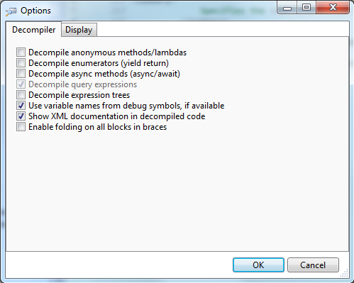
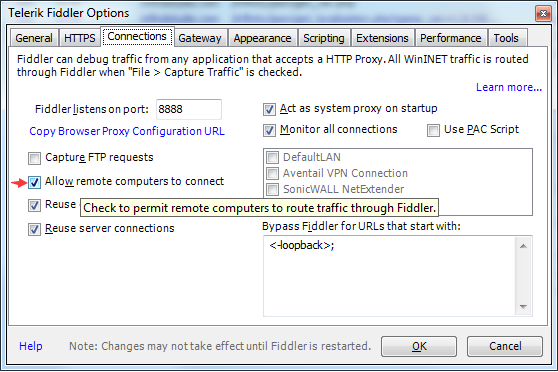
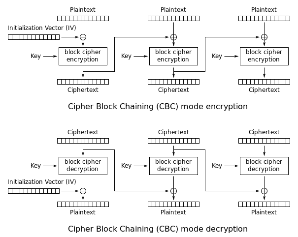
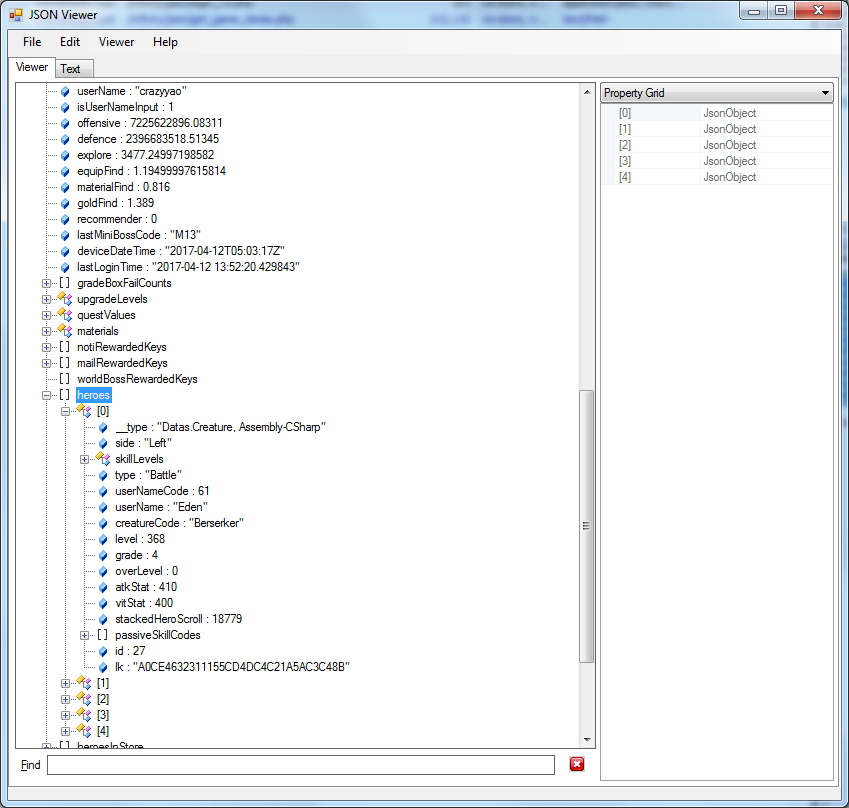

无限远征队
===========================


000
---------------------------
最近玩了一款名叫无限远征队的游戏。这又是一款棒子出的放置类游戏。玩了几天又想改游戏了，不好意思啦！

001
---------------------------
下载到游戏的安装包，解开看了一下，在/assets/bin/Data/Managed下面看到了UnityEngine.dll。所以这次又是UnityEngine。除此之外还有很多Unity的assets文件。有机会我介绍一下assets文件的文件格式。在这篇文章里这些资源文件没什么用。

对付UnityEngine我们需要的反编译工具是ILSpy。可以在这里下载这个工具http://ilspy.net/



要注意有一些代码会有[DebuggerHidden]的属性。ilspy默认是不会反编译这些代码的。所以需要在设置里打开。
view->show internal types and members选中
view->options 改成如下配置


老规矩我们还需要抓一些包。这次我找到了一种新的抓包方法，使用Fiddler4来抓包。对于HTTP的连接Fiddler比Wireshark能更好的分析和显示，但是Fiddler的缺点是只能分析HTTP的数据。在PC上打开fiddler4，然后菜单Tools->Telerik Fiddler Options->Connections里选中Allow remote computers to connect.



然后在手机的无线网络设置里设置代理服务器。由于不同手机rom的设置方法不一样，这里就不详细说了，大家可以自己百度。总之将手机的HTTP代理服务器设置成你PC的地址+Fiddler默认端口号8888就可以了。

打开app后Fiddler中可以看到以下这些http请求。

```
POST http://mfindstudio.com/infinity/json/get_ver.php
POST http://mfindstudio.com/infinity/json/get_localization.php
POST http://mfindstudio.com/infinity/json/login_v2.php
POST http://mfindstudio.com/infinity/json/get_game_datas.php
POST http://mfindstudio.com/infinity/json/save_player_v2.php
```

仔细察看这些请求发现从get_game_datas.php开始每一个http请求的头部都会带上token和subToken这两个字段。如下。

```

POST http://mfindstudio.com/infinity/json/login_v2.php HTTP/1.1
versionName: 1.8.0
localCode: zh-Hans
X-Unity-Version: 5.5.0p3
Content-Length: 449
versionCode: 142
Content-Type: text/json
User-Agent: Dalvik/2.1.0 (Linux; U; Android 7.0; MI 5 MIUI/V8.2.1.0.NAACNEB)
Host: mfindstudio.com
Connection: Keep-Alive
Accept-Encoding: gzip

......

HTTP/1.1 200 OK
Server: nginx
Date: Mon, 10 Apr 2017 04:05:06 GMT
Content-Type: application/json; charset=utf-8
Connection: keep-alive
X-Powered-By: PHP/5.5.17p1
Set-Cookie: PHPSESSID=422721; path=/
Expires: Thu, 19 Nov 1981 08:52:00 GMT
Cache-Control: no-store, no-cache, must-revalidate, post-check=0, pre-check=0
Pragma: no-cache
token: 62yAk57/7Pz//E2+semLkrpCQ4rdcLEUNqXtPAG2goQ=
Content-Length: 301

......

POST http://mfindstudio.com/infinity/json/get_game_datas.php HTTP/1.1
versionName: 1.8.0
localCode: zh-Hans
X-Unity-Version: 5.5.0p3
subToken: WBTf7ZNk0LdF0lQW4di7Em51VsocJ5pB1P1yejDXZkKwrbGBeTtl6F+xo756Ctg6bVxi145YmxP2Ll9gHbjfbA==
versionCode: 142
Content-Type: text/json
token: 62yAk57/7Pz//E2+semLkrpCQ4rdcLEUNqXtPAG2goQ=
server: China1
Content-Length: 52
User-Agent: Dalvik/2.1.0 (Linux; U; Android 7.0; MI 5 MIUI/V8.2.1.0.NAACNEB)
Host: mfindstudio.com
Connection: Keep-Alive
Accept-Encoding: gzip

......


POST http://mfindstudio.com/infinity/json/save_player_v2.php HTTP/1.1
versionName: 1.8.0
localCode: zh-Hans
X-Unity-Version: 5.5.0p3
subToken: WBTf7ZNk0LdF0lQW4di7Em51VsocJ5pB1P1yejDXZkJBtrVl6y959y4HHIz8pAZ7vdPlZiTOO4gNT8YfR0PWSQ==
versionCode: 142
Content-Type: text/json
token: 62yAk57/7Pz//E2+semLkrpCQ4rdcLEUNqXtPAG2goQ=
server: China1
Content-Length: 32440
User-Agent: Dalvik/2.1.0 (Linux; U; Android 7.0; MI 5 MIUI/V8.2.1.0.NAACNEB)
Host: mfindstudio.com
Connection: Keep-Alive
Accept-Encoding: gzip

......

```

通常这种字段这是用来防止做外挂或者重放攻击的。我们发现token字段每一次都一样。这个字段的值是从login_v2.php的response header传给客户端的。而subToken则前面40多字节是一样的，后面不一样。考虑到token和subToken是base64编码的，他们的实际长度分别为32字节和64字节。

代码里面全文搜索"subToken"找到以下代码

```C#
public void Request(string url, IDictionary<string, object> data, MFHttpManager.OsHttpRequestDelegate onResponseDelegate, bool needRetry = true, MFHttpManager.CachePolicy cachePolicy = MFHttpManager.CachePolicy.None)
{
	object obj = this.requestQueue;
	lock (obj)
	{
		JsonWriterSettings jsonWriterSettings = new JsonWriterSettings();
		jsonWriterSettings.AddTypeConverter(new CustomConverter());
		StringBuilder stringBuilder = new StringBuilder();
		JsonWriter jsonWriter = new JsonWriter(stringBuilder, jsonWriterSettings);
		jsonWriter.Write(data);
		string text = stringBuilder.ToString();
		Dictionary<string, string> dictionary = new Dictionary<string, string>(this.commonHeaders);
		dictionary["Content-Type"] = "text/json";
		dictionary["Content-Length"] = text.Length.ToString();
		if (this.token != null)
		{
			string value = global::Security.AES_encrypt(SystemInfo.deviceUniqueIdentifier + ":" + ++this.accessSeq, this.token);
			dictionary.Add("token", this.token);
			dictionary.Add("subToken", value);
		}
		MFHttpManager.RequestInfo obj2 = new MFHttpManager.RequestInfo(url, text, dictionary, needRetry, onResponseDelegate, cachePolicy);
		this.requestQueue.Enqueue(obj2);
	}
	this.RequestInQueue();
}

public static string AES_encrypt(string input, string key)
{
	string result;
	try
	{
		RijndaelManaged rijndaelManaged = new RijndaelManaged();
		rijndaelManaged.KeySize = 256;
		rijndaelManaged.BlockSize = 256;
		rijndaelManaged.Mode = CipherMode.CBC;
		rijndaelManaged.Padding = PaddingMode.PKCS7;
		rijndaelManaged.Key = Security.MakeKey(key, 32);
		rijndaelManaged.IV = Security.MakeKey(Security.iv, 32);
		ICryptoTransform transform = rijndaelManaged.CreateEncryptor(rijndaelManaged.Key, rijndaelManaged.IV);
		byte[] inArray = null;
		using (MemoryStream memoryStream = new MemoryStream())
		{
			using (CryptoStream cryptoStream = new CryptoStream(memoryStream, transform, CryptoStreamMode.Write))
			{
				byte[] bytes = Encoding.UTF8.GetBytes(input);
				cryptoStream.Write(bytes, 0, bytes.Length);
			}
			inArray = memoryStream.ToArray();
		}
		string text = Convert.ToBase64String(inArray);
		result = text;
	}
	catch
	{
		result = string.Empty;
	}
	return result;
}

```

可以看到subtoken其实是用deviceid+":"+sequencenumber 得到的字符串再用AES加密就可以了。奇怪的是这里的AES似乎有些不同。因为它密钥长度和分组大小都是32字节。而标准的AES密钥可以是16或32字节，分组则固定为16字节。我查了一些资料得知AES其实是rijndael的一个特定例子。反正这个游戏所使用的加密算法不是标准AES。这就比较麻烦了。我网上找了半天python的库也只找到了一个block cipher的源代码。需要自己实现CBC和PKCS7才能实现完整的加解密算法。

block cipher在这里　https://gist.github.com/jeetsukumaran/1291836

密码学中，分组密码的工作模式允许使用同一个分组密码密钥对多于一块的数据进行加密，并保证其安全性。分组密码自身只能加密长度等于密码分组长度的单块数据，若要加密变长数据，则数据必须先被划分为一些单独的密码块。通常而言，最后一块数据也需要使用合适填充方式将数据扩展到匹配密码块大小的长度。这种填充方法是有很多标准的。PKCS7就是其中之一。

https://tools.ietf.org/html/rfc2315

如果每一个分组都是独立加密的话，当数据中有多个分组完全一样，那加密后的密文也会完全一样。人们根据分组出现的频率就有可能破解加密算法。所以实际运用中通常都会加上IV以及mode of operation. CBC就是一种常用的工作模式。

https://en.wikipedia.org/wiki/Block_cipher_mode_of_operation



看起来很麻烦，但其实写起来并不复杂(Python 的代码效率真高啊)

```python
def rijndael32_cbc_pkcs7_decrypt(data, key, iv):
    r = Rijndael(key, block_size = 32)
    plaindata = b""
    for i in range(0, len(data)/32):
        blockdata = data[i*32:i*32+32]
        decrypted = r.decrypt(blockdata)
        for j in range(0, 32):
            plaindata += chr(ord(decrypted[j])^ord(iv[j]))
        iv = blockdata
    pkcs7padlen = ord(plaindata[-1])
    return plaindata[0:len(plaindata)-pkcs7padlen]

def rijndael32_cbc_pkcs7_encrypt(data, key, iv):
    r = Rijndael(key, block_size = 32)
    pkcs7padlen = 32 - len(data)%32
    data = data + chr(pkcs7padlen) * pkcs7padlen
    
    encrypted = b""    
    for i in range(0, len(data)/32):
        blockdata = data[i*32:i*32+32]
        plaindata = ""
        for j in range(0, 32):
            plaindata += chr(ord(blockdata[j])^ord(iv[j]))        
        iv = r.encrypt(plaindata)
        encrypted += iv
    return encrypted
```

利用这连个函数我们来验证一下这个求subToken的算法。值得一提的是我发现虽然key看上去像32字节长的字符串base64编码后的结果，但其实真正的key是他的前32字节（faint, 这个估计是bug. 作者显然没有意识到需要base64解码。被截断成32字节的key也是意外）

```
encrypted = base64.b64decode("WBTf7ZNk0LdF0lQW4di7Em51VsocJ5pB1P1yejDXZkJBtrVl6y959y4HHIz8pAZ7vdPlZiTOO4gNT8YfR0PWSQ==")
key="62yAk57/7Pz//E2+semLkrpCQ4rdcLEUNqXtPAG2goQ="[0:32]
iv ="hru237vl8^#d9!d0d39e;d2ke-dng94w"
print rijndael32_cbc_pkcs7_decrypt(encrypted, key, iv)
```

得到的结果是"ecdf**************************b379:2"（*是马赛克）。

002
---------------------------

后来我发现在login_v2的时候会返回用户存档。然后app会每过一段时间或者是切回桌面的时候将本地的存档上传服务器。所以只要拦截login_v2这个请求就可以轻易的修改用户存档了。用户存档是一段json格式的数据，如下



可以看到每一个数据结构中都有一个叫lk的字段。仔细读了一下代码，lk是对数据结构的一个校验，用来防止篡改数据的。比如说以下代码是用来计算heros结构的校验值

```
public override string GenerateKey()
{
	StringBuilder stringBuilder = new StringBuilder();
	stringBuilder.Append(this.id);
	stringBuilder.Append(this.type);
	stringBuilder.Append(this.creatureCode);
	stringBuilder.Append(this.level);
	stringBuilder.Append(this.userNameCode);
	stringBuilder.Append(this.userName);
	stringBuilder.Append(this.grade);
	stringBuilder.Append(this.atkStat);
	stringBuilder.Append(this.vitStat);
	stringBuilder.Append(this.stackedHeroScroll);
	foreach (ObscuredString current in this.passiveSkillCodes)
	{
		stringBuilder.Append(current);
	}
	return base.ComputeHash(Encoding.UTF8.GetBytes(stringBuilder.ToString()));
}
```

所以Unity的问题或者说是C#的问题就是太容易被逆向了。这个软件有很多数据保护的措施在逆向以后都能被轻易的破解。

之后我的dns_proxy上场。将手机的dns指向我的dns_proxy. 将mfindstudio.com指向我的http_proxy的IP. 我的http_proxy会篡改login_v2.php返回的数据，这样就能够修改存档了。

我试着改了一下人物等级或者装备什么的都非常顺利。但是当我修改游戏中货币钻石的时候，一分钟以后号就被封了。说明服务器端对于一些敏感数据还是会有更多的验证的。

换一个deviceid继续吧。接下来的问题是怎样改才能在不被发现的情况适当的修改游戏呢。我从高中就开始改游戏有一个原则是不能改的太过分，因为一次又一次的教训告诉我，一旦改过分了，就会在很短的时间内失去乐趣。因此一般我只是会改比如说游戏中可能出现的装备，装备掉落率10x, 经验增加速度10x, 每次掉落给变量必定极品等等。我的目的是节约时间避免无谓的mf。于是我又读了大约几十个文件数万行代码，就为了弄明白装备的掉落过程，装备属性以及变量范围等等。然后手工打造了一个梦幻存档。


003
--------------------------

最后这个存档又被封了。被封的原因是我在一天之内冲到了PK排行榜的前十。然后有人研究我的装备发现所有的变量都是极品，而且很多装备的属性都是一模一样，就举报了我。之后我突然就失去了兴趣，把游戏给删了。看来这次又改的太过分了。控制不住啊。

事情过去了一个多月了，游戏已经更新。所以写下这篇文章存档。


The End
